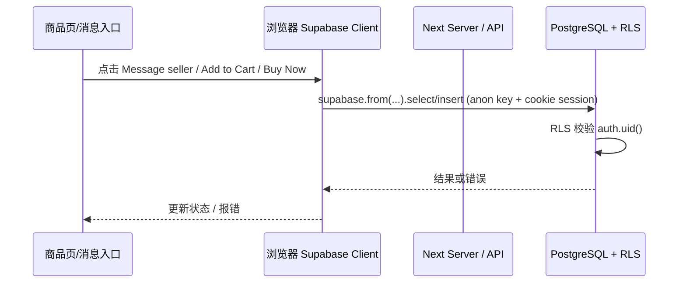

# 商品页 / 私聊 问题：架构层根因与规范化修复

## 1. 架构与数据流



- **服务端**：`createClient()` 来自 `@/lib/supabase/server`，用 `cookies()` 读 session，与中间件 `updateSession` 刷新一致。
- **客户端**：`createClient()` 来自 `@/lib/supabase/client`（`createBrowserClient`），同一请求下应与服务端共享 cookie 中的 session。
- **RLS**：所有 `from('conversations')` / `from('products')` 的请求都在 DB 内按 `auth.uid()` 与策略做过滤。

问题出在「谁在什么时机、用什么方式」访问 DB，以及 RLS/约束与前端用法是否匹配，而不是单点改文案或 catch 错误。

---

## 2. Message seller：唯一约束报错

### 2.1 现象

点击 Message seller 后长时间等待，最终报错：  
`key value violates unique constraint "conversations_participant1_id_participant2_id_convers..."`

### 2.2 根因（架构层）

- **表约束**：`conversations` 有 `UNIQUE(participant1_id, participant2_id, conversation_type)`。  
  **(A, B)** 与 **(B, A)** 是两行，都允许存在；冲突只会在「再次插入 (A, B)」时发生。
- **当前实现**：前端用 PostgREST 的 `.or()` 做「对称匹配」查已有会话：
  ```ts
  .or(`and(participant1_id.eq.${user.id},participant2_id.eq.${otherUserId}),and(participant1_id.eq.${otherUserId},participant2_id.eq.${user.id})`)
  ```
- **问题**：
  1. PostgREST 的 `.or()` 与嵌套 `and()`、UUID 的拼接在 URL/编码下可能被错误解析，导致「本应命中已有会话」的 SELECT 实际返回 0 行。
  2. 于是前端认为「没有会话」并执行 INSERT；若 (user, other) 的会话已存在（例如之前用 (user, other) 创建过），就会触发唯一约束。
- **结论**：根因在「查已有会话」的语义依赖了不可靠的客户端 filter 写法，而不是「后端没做幂等」。在架构上应把「查已有 + 无则创建」收口到**单一、可信的数据层**。

### 2.3 规范化修复

- **数据层**：在 PostgreSQL 中提供**唯一入口**：RPC `get_or_create_private_conversation(p_other_id uuid)`。
  - 在 DB 内用 SQL 做对称匹配：  
    `(participant1_id = auth.uid() AND participant2_id = p_other_id) OR (participant1_id = p_other_id AND participant2_id = auth.uid())`
  - 有则返回 `id`，无则 `INSERT`；若并发导致唯一约束冲突，在 EXCEPTION 里再 SELECT 一次并返回。  
  这样不依赖 PostgREST 的 `.or()` 语法，也不依赖前端再发第二次请求。
- **前端**：`useConversation` 只做：  
  - 业务校验（本人、目标状态、黑名单等）  
  - 调用 `supabase.rpc('get_or_create_private_conversation', { p_other_id })`  
  - 根据返回的 `id` 跳转。  
  不再在前端用 `.or()` 查会话，也不再在前端做「唯一冲突后重试查」的补救逻辑。

---

## 3. Add to Cart / Buy Now：慢与「商品不存在或已被删除」

### 3.1 现象

- Add to Cart：点击后要等很久才看到加购结果。
- Buy Now：提示「商品不存在或已被删除」。

### 3.2 根因（架构层）

- **products 的 RLS**（`153_add_user_status_field.sql`）：  
  只有满足以下之一，才能 SELECT 到行：  
  - 商品 `status = 'active'` 且卖家 `profiles.status = 'active'`；或  
  - 当前用户是卖家或 admin/support。  
  即：**可见性由「商品 + 卖家状态」在请求时刻的 RLS 结果决定**。
- **数据流**：
  1. 服务端渲染商品页时用 `createClient()`（server）拉 product，此时 RLS 通过则页面有数据。
  2. 用户点击 Buy Now 时，客户端用 `createClient()`（client）再查一次 `products` 做校验。
- **可能原因**：
  1. **时序**：从服务端渲染到用户点击之间，商品下架或卖家被禁/暂停，客户端再查时 RLS 不通过，得到 0 行 → 「商品不存在或已被删除」。
  2. **会话一致性**：理论上 server 与 client 共用 cookie session，但若存在刷新/过期或边缘情况，client 的 `auth.uid()` 可能与 server 不一致或为空，导致 RLS 结果不同。
  3. **职责分散**：「能否购买」的判断分散在服务端（渲染时）和客户端（点击时）两处，没有单一权威来源，容易出现「页面还显示可买，但接口已拒绝」的体验。

### 3.3 规范化修复

- **单一权威校验入口**：  
  「能否购买 / 加购」的**最终校验**放在服务端，由**同一请求上下文**（同一 session/cookie）执行，避免依赖客户端再次查库。
- **实现方式**：
  - 新增 **API 路由**（如 `POST /api/checkout/validate-product`）：  
    入参 `productId`；在 API 内用 `createClient()`（server）查 `products`（及必要时 profiles），校验 status、库存、价格。  
    返回结构化结果：`{ ok: true, product: { id, price, ... } }` 或 `{ ok: false, reason: 'not_found'|'inactive'|'out_of_stock'|'price_changed' }`。
  - **Buy Now**：  
    前端 `handleBuyNow` 先调该 API；仅当 `ok === true` 时再 `addItem` 并 `router.push('/checkout')`。  
    这样「商品是否存在、是否可买」完全由服务端在**同一 RLS 上下文**下判定，与渲染时一致；错误信息也可统一、友好。
- **Add to Cart**：  
  保持「乐观更新 + 后台校验」的交互，但**校验逻辑**可逐步改为调用同一 API（或共享的 server 校验函数），这样「可加购」的判定也收口到服务端，避免客户端直接查 products 带来的 RLS/时序差异。

---

## 4. 错误信息与日志

- **生产**：对用户只展示固定、友好文案（如「商品不存在或已被删除」「无法发起私聊，请重试」），不暴露约束名、SQL、后端堆栈。
- **开发**：在服务端/前端对失败请求打日志（如 `reason`、`productId`、不包含敏感信息的 error），便于排查 RLS、时序、session 问题。

---

## 5. 实施清单（规范化）

| 层级 | 项 | 说明 |
|------|---|------|
| 数据层 | RPC `get_or_create_private_conversation` | 对称查已有会话；无则 INSERT；唯一冲突时 SELECT 再返回；调用方仅传 `p_other_id`，当前用户由 `auth.uid()` 取得。 |
| 前端 | `useConversation` 改为只调 RPC | 保留目标用户状态、黑名单等校验；删除前端 `.or()` 查会话与「唯一冲突后重试」逻辑。 |
| 服务端 | API `POST /api/checkout/validate-product` | 入参 productId；server createClient 查 product + 校验；返回 `{ ok, product? }` 或 `{ ok: false, reason }`。 |
| 前端 | Buy Now 走校验 API | handleBuyNow 先调该校验 API，通过后再 addItem 并跳转 checkout。 |
| 可选 | Add to Cart 校验收口 | 乐观更新不变，校验改为调同一 API 或共享 server 逻辑，保证与 Buy Now 一致。 |

按上述清单落地后，**会话创建**与**商品可购买性**都从「前端多步 + 不可靠 filter/RLS 边缘」收口到**数据层 RPC + 服务端 API**，从架构上避免在症状层继续修修补补。
