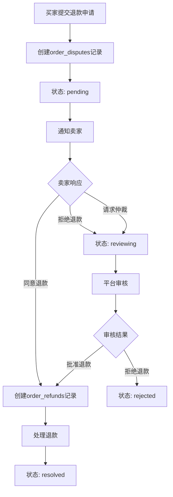
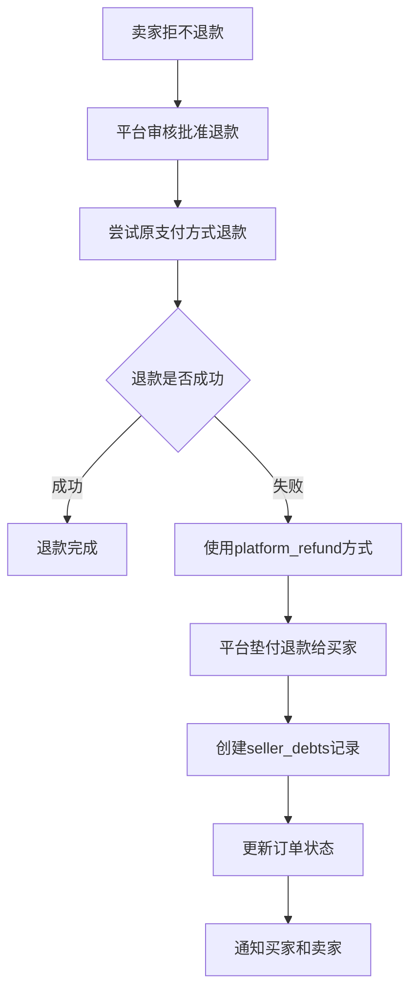

# 退款与争议管理系统完整方案

## 一、系统概述

本文档系统性地阐述买家退款申请、平台审核、卖家拒不退款处理以及卖家拒不支付带货佣金处理的完整流程和机制。

## 二、买家退款申请流程

### 2.1 退款申请入口

**触发场景**：
1. 买家主动申请退款（通过订单详情页）
2. 系统自动创建退款争议（如：7天未发货）
3. 订单质量问题、发错商品等

**申请方式**：
- API: `POST /api/orders/[id]/dispute`
- 前端页面: `/orders/[id]/dispute`

**申请参数**：
```typescript
{
  disputeType: 'refund_request' | 'seller_not_shipping' | 'quality_issue' | 'wrong_item' | 'other',
  reason: string,  // 退款原因说明
  evidence: string[]  // 证据图片URL数组
}
```

### 2.2 退款申请处理流程



### 2.3 数据库状态流转

**order_disputes 状态**：
- `pending`: 待卖家响应
- `reviewing`: 平台审核中
- `resolved`: 已解决
- `rejected`: 已拒绝

**order_refunds 状态**：
- `pending`: 待处理
- `processing`: 处理中
- `completed`: 已完成
- `failed`: 处理失败

## 三、平台审核判断退款的处理

### 3.1 审核触发条件

**自动进入审核的情况**：
1. 卖家拒绝退款申请
2. 卖家请求平台仲裁
3. 卖家在规定时间内未响应（如：48小时）
4. 系统自动创建的争议（如：7天未发货）

### 3.2 平台审核流程

**审核API**: `POST /api/admin/disputes`

**审核参数**：
```typescript
{
  disputeId: string,
  resolution: string,  // 审核决议说明
  refundAmount?: number,  // 退款金额（如果批准退款）
  refundMethod?: 'original_payment' | 'bank_transfer' | 'platform_refund'
}
```

**审核决策逻辑**：

1. **批准全额退款**：
   - 卖家7天未发货
   - 商品质量问题（有充分证据）
   - 发错商品（有充分证据）
   - 其他明显卖家责任的情况

2. **批准部分退款**：
   - 商品部分损坏但可修复
   - 商品与描述轻微不符
   - 双方都有一定责任的情况

3. **拒绝退款**：
   - 买家无正当理由
   - 商品符合描述，买家主观不满意
   - 买家已使用商品且无质量问题

### 3.3 审核后的处理

**批准退款时**：
1. 创建 `order_refunds` 记录
2. 调用 `processRefund` 处理退款
3. 更新 `order_disputes` 状态为 `resolved`
4. 通知买家和卖家

**拒绝退款时**：
1. 更新 `order_disputes` 状态为 `rejected`
2. 通知买家和卖家
3. 订单继续正常流程

## 四、卖家拒不退款的处理

### 4.1 拒不退款的识别

**识别场景**：
1. 卖家明确拒绝退款（`action: 'refuse'`）
2. 卖家在规定时间内未响应退款申请
3. 卖家同意退款但退款处理失败（原支付方式退款失败）

### 4.2 平台垫付退款机制

**核心机制**：平台先行垫付退款给买家，同时创建卖家债务记录

**处理流程**：



### 4.3 卖家债务管理

**债务创建**：
- 表：`seller_debts`
- 字段：
  - `debt_amount`: 债务金额
  - `debt_reason`: 债务原因（如："Platform advanced refund"）
  - `status`: `pending` | `paid` | `collected` | `forgiven`
  - `collection_method`: 扣款方式

**债务追偿方式**：

1. **从保证金中扣除**（优先）：
   - 检查卖家保证金余额
   - 如果保证金充足，自动扣除
   - 更新债务状态为 `collected`

2. **从后续订单收入中扣除**：
   - 卖家后续订单收款时，优先扣除债务
   - 通过 `payout_deduction` 方式

3. **手动追偿**：
   - 管理员联系卖家要求还款
   - 卖家主动还款后，更新状态为 `paid`

### 4.4 债务追偿实现

**自动扣款逻辑**（需要实现）：
```typescript
// 在卖家收款时检查并扣除债务
async function deductSellerDebtOnPayout(
  sellerId: string,
  payoutAmount: number,
  supabaseAdmin: SupabaseClient
) {
  // 1. 查询卖家待偿还债务总额
  const totalDebt = await getSellerTotalDebt(sellerId)
  
  // 2. 如果债务 > 0，从本次收款中扣除
  if (totalDebt > 0) {
    const deductionAmount = Math.min(totalDebt, payoutAmount)
    
    // 3. 更新债务记录
    await supabaseAdmin
      .from('seller_debts')
      .update({ 
        status: 'collected',
        collection_method: 'payout_deduction',
        collected_at: new Date().toISOString()
      })
      .eq('seller_id', sellerId)
      .eq('status', 'pending')
      .order('created_at', { ascending: true })
      .limit(1) // 先还最早的债务
    
    // 4. 返回实际支付给卖家的金额
    return payoutAmount - deductionAmount
  }
  
  return payoutAmount
}
```

**从保证金扣除**（需要实现）：
```typescript
// 检查并从保证金中扣除债务
async function deductDebtFromDeposit(
  sellerId: string,
  supabaseAdmin: SupabaseClient
) {
  // 1. 查询卖家保证金余额
  const depositBalance = await getSellerDepositBalance(sellerId)
  
  // 2. 查询待偿还债务
  const totalDebt = await getSellerTotalDebt(sellerId)
  
  // 3. 如果保证金 >= 债务，从保证金中扣除
  if (depositBalance >= totalDebt) {
    // 创建保证金扣款记录
    await createDepositDeduction({
      sellerId,
      amount: totalDebt,
      reason: '偿还平台垫付退款债务',
      supabaseAdmin
    })
    
    // 更新债务状态
    await supabaseAdmin
      .from('seller_debts')
      .update({ 
        status: 'collected',
        collection_method: 'deposit_deduction',
        collected_at: new Date().toISOString()
      })
      .eq('seller_id', sellerId)
      .eq('status', 'pending')
  }
}
```

### 4.5 拒不退款的惩罚机制

**建议的惩罚机制**：

1. **首次拒不退款**：
   - 警告通知
   - 记录到卖家信用档案

2. **多次拒不退款**：
   - 限制新订单创建
   - 提高保证金要求
   - 暂停卖家功能

3. **严重拒不退款**：
   - 冻结卖家账户
   - 从保证金中强制扣除
   - 考虑终止合作

## 五、卖家拒不支付带货佣金的处理

### 5.1 佣金支付义务机制

**触发条件**：
- 当卖家累计未支付佣金 ≥ 5 USD 时，系统自动创建 `commission_payment_obligations` 记录
- 支付期限：7天（从创建义务记录开始）

**数据库表**：
- `commission_payment_obligations`: 佣金支付义务
- `affiliate_commissions`: 待支付佣金记录

### 5.2 拒不支付佣金的识别

**识别场景**：
1. 支付义务到期（`due_date < NOW()`）且状态仍为 `pending`
2. 卖家明确拒绝支付佣金
3. 卖家账户余额不足无法支付

### 5.3 惩罚机制（已实现）

**惩罚等级**（逐步升级）：

1. **第一次逾期** (`penaltyCount = 0`):
   - 惩罚类型：`warning`
   - 操作：发送警告通知
   - 状态：`overdue`

2. **第二次逾期** (`penaltyCount = 1`):
   - 惩罚类型：`restrict_sales`
   - 操作：限制创建新商品/订单
   - 状态：`overdue`

3. **第三次逾期** (`penaltyCount = 2`):
   - 惩罚类型：`suspend`
   - 操作：更新 `profiles.role = 'seller_suspended'`
   - 状态：`overdue`

4. **第四次及以上逾期** (`penaltyCount >= 3`):
   - 惩罚类型：`disable`
   - 操作：
     - 更新 `profiles.role = 'user'`（移除卖家角色）
     - 隐藏所有商品 (`products.status = 'hidden'`)
   - 状态：`overdue`

**实现位置**：
- 文件：`src/lib/commissions/penalty-manager.ts`
- 函数：`checkAndApplyPenalties`

### 5.4 自动惩罚执行

**定时任务**（需要实现）：
```typescript
// 建议创建定时任务，每天检查逾期佣金支付义务
// API: /api/cron/commission-penalties
export async function GET(request: NextRequest) {
  const supabaseAdmin = createAdminClient(...)
  
  // 检查并应用惩罚
  await checkAndApplyPenalties(supabaseAdmin)
  
  return NextResponse.json({ success: true })
}
```

**惩罚记录**：
- 表：`seller_penalties`
- 字段：
  - `penalty_type`: `warning` | `restrict_sales` | `suspend` | `disable`
  - `status`: `active` | `resolved` | `expired`
  - `obligation_id`: 关联的支付义务ID

### 5.5 佣金追偿机制（建议实现）

**从保证金扣除佣金债务**：
```typescript
// 当卖家拒不支付佣金时，从保证金中扣除
async function deductCommissionFromDeposit(
  sellerId: string,
  obligationId: string,
  supabaseAdmin: SupabaseClient
) {
  // 1. 获取支付义务详情
  const { data: obligation } = await supabaseAdmin
    .from('commission_payment_obligations')
    .select('*')
    .eq('id', obligationId)
    .single()
  
  if (!obligation || obligation.status !== 'overdue') {
    return { success: false, error: 'Invalid obligation' }
  }
  
  // 2. 检查保证金余额
  const depositBalance = await getSellerDepositBalance(sellerId)
  
  // 3. 如果保证金充足，扣除佣金
  if (depositBalance >= obligation.total_amount) {
    // 创建保证金扣款记录
    await createDepositDeduction({
      sellerId,
      amount: obligation.total_amount,
      reason: '扣除未支付佣金',
      supabaseAdmin
    })
    
    // 更新支付义务状态
    await supabaseAdmin
      .from('commission_payment_obligations')
      .update({
        status: 'paid',
        paid_at: new Date().toISOString()
      })
      .eq('id', obligationId)
    
    // 更新相关佣金记录状态
    await supabaseAdmin
      .from('affiliate_commissions')
      .update({ status: 'paid' })
      .in('order_id', (
        await supabaseAdmin
          .from('orders')
          .select('id')
          .eq('seller_id', sellerId)
      ).data?.map((o: any) => o.id) || [])
      .eq('status', 'pending')
    
    return { success: true }
  }
  
  return { success: false, error: 'Insufficient deposit balance' }
}
```

## 六、系统改进建议

### 6.1 退款流程改进

1. **自动退款超时处理**：
   - 卖家48小时未响应，自动进入平台审核
   - 实现定时任务检查待响应争议

2. **退款金额计算**：
   - 支持部分退款（如：商品部分损坏）
   - 考虑运费、税费的退款分配

3. **退款通知增强**：
   - 退款处理各阶段通知
   - 退款到账通知

### 6.2 债务追偿改进

1. **自动扣款机制**：
   - 卖家收款时自动扣除债务
   - 从保证金中自动扣除债务

2. **债务优先级**：
   - 按创建时间优先偿还最早债务
   - 支持部分偿还

3. **债务统计和报告**：
   - 卖家债务总额查询
   - 债务历史记录
   - 债务偿还进度

### 6.3 佣金支付改进

1. **自动从保证金扣除**：
   - 佣金逾期后，自动从保证金扣除
   - 避免惩罚升级

2. **佣金支付提醒**：
   - 支付义务创建时通知
   - 到期前3天、1天提醒
   - 逾期后每日提醒

3. **惩罚解除机制**：
   - 卖家支付佣金后，自动解除惩罚
   - 恢复卖家功能

### 6.4 系统监控和告警

1. **关键指标监控**：
   - 待处理争议数量
   - 待偿还债务总额
   - 逾期佣金支付义务数量

2. **告警机制**：
   - 债务总额超过阈值告警
   - 争议处理超时告警
   - 惩罚升级告警

## 七、数据库表关系图

```
orders
  ├── order_disputes (1:N)
  │     └── order_refunds (1:1)
  │           └── seller_debts (1:1, 当platform_refund时)
  │
  └── affiliate_commissions (1:N)
        └── commission_payment_obligations (N:1, 累计≥5USD时)
              └── seller_penalties (1:N, 逾期时)
```

## 八、关键API端点

### 8.1 买家相关
- `POST /api/orders/[id]/dispute` - 创建退款争议
- `GET /api/orders/[id]/dispute` - 查看争议详情

### 8.2 卖家相关
- `POST /api/orders/[id]/dispute/respond` - 响应争议（同意/拒绝/请求仲裁）
- `GET /api/commissions/pay` - 查看待支付佣金
- `POST /api/commissions/pay` - 支付佣金

### 8.3 管理员相关
- `GET /api/admin/disputes` - 查看所有争议
- `POST /api/admin/disputes` - 审核并解决争议
- `POST /api/admin/refunds/process` - 处理退款
- `GET /api/admin/seller-debts` - 查看卖家债务（需实现）
- `POST /api/admin/commissions/[id]/settle` - 平台代为结算佣金（需实现）

### 8.4 定时任务
- `GET /api/cron/check-disputes` - 检查超时争议（需实现）
- `GET /api/cron/commission-penalties` - 检查并应用佣金惩罚（需实现）
- `GET /api/cron/deduct-debts` - 自动扣除债务（需实现）

## 九、实施优先级

### 高优先级（立即实施）
1. ✅ 退款争议创建和响应机制（已实现）
2. ✅ 平台审核退款机制（已实现）
3. ✅ 平台垫付退款和债务记录（已实现）
4. ⚠️ 从保证金自动扣除债务（需实现）
5. ⚠️ 从后续收款自动扣除债务（需实现）

### 中优先级（近期实施）
6. ⚠️ 佣金逾期自动从保证金扣除（需实现）
7. ⚠️ 争议超时自动进入审核（需实现）
8. ⚠️ 债务统计和报告功能（需实现）
9. ⚠️ 惩罚解除机制（需实现）

### 低优先级（长期优化）
10. ⚠️ 部分退款支持（需实现）
11. ⚠️ 退款金额计算优化（需实现）
12. ⚠️ 系统监控和告警（需实现）

## 十、总结

当前系统已实现核心的退款争议处理机制，包括：
- ✅ 买家申请退款
- ✅ 卖家响应机制
- ✅ 平台审核退款
- ✅ 平台垫付退款
- ✅ 卖家债务记录
- ✅ 佣金支付义务
- ✅ 佣金逾期惩罚

**需要完善的关键功能**：
1. 债务自动追偿机制（从保证金/收款中扣除）
2. 佣金逾期自动从保证金扣除
3. 争议超时自动处理
4. 惩罚解除机制
5. 系统监控和告警

这些改进将形成完整的退款和争议管理闭环，确保平台、买家和卖家的权益得到有效保护。
