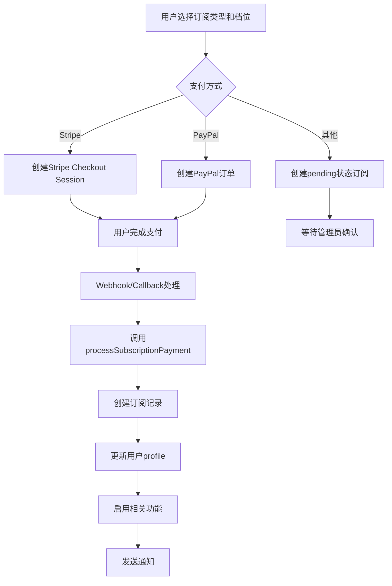

# 订阅系统完整分析报告

## 一、系统概述

订阅系统是平台的核心功能之一，支持三种订阅类型：卖家订阅、带货者订阅和打赏功能订阅。系统采用"订阅费用 = 免费保证金额度"的创新模式，将订阅与保证金机制紧密结合。

## 零、平台官方收款账户架构（核心设计原则）

### 0.1 平台账户的职责边界

**平台官方收款账户（Platform Merchant Account）**是唯一、中心化的账户，用于接收：

| 资金类型 | 是否进平台账户 | 说明 |
|---------|--------------|------|
| 订阅费用 | ✅ | 平台服务收入 |
| 卖家保证金 | ✅ | 平台风控资金（冻结/标记，可用于赔付/扣罚，可退款） |
| 平台服务费 | ✅ | 平台收入 |
| 违规扣款 | ✅ | 从保证金中扣 |
| 技术服务费 | ✅ | B端收费 |

**平台账户不负责**：

| 资金类型 | 原因 |
|---------|------|
| 商品货款 | ❌ | 法律风险 + 税务风险 |
| 买家付款给卖家 | ❌ | 应直付卖家或托管（买家直付模型） |

### 0.2 资金流向设计

**订阅支付流程**：
```
用户 → 平台官方收款账户 → 平台收入
```
- 订阅费用通过 `createCheckoutSession` 创建，**不传递 destinationAccountId**
- 资金直接进入平台 Stripe/PayPal 账户
- 完全不涉及卖家收款账户

**保证金支付流程**：
```
卖家 → 平台官方收款账户（冻结/标记）
```
- 保证金不是收入，是"风控资金"
- 不自动转走，不参与平台营收
- 可用于赔付/扣罚，可在退出卖家时退款
- 通过 `deposits/pay` API，**不传递 destinationAccountId**

**订单支付流程（买家直付模型）**：
```
买家 → 卖家收款账户（直接支付）
```
- 通过 `create-order-checkout-session` API
- 传递 `destinationAccountId = sellerAccountId`（卖家 Stripe Connect 账户）
- 使用 Stripe Connect destination charges
- 平台不碰货款，资金直接进入卖家账户

### 0.3 技术实现

**平台账户数据模型**：
- `payment_accounts` 表支持平台账户（`is_platform_account = true`）
- `seller_id` 为 NULL（平台账户）
- 每种支付方式只能有一个平台账户（唯一约束）
- 通过 `get_platform_payment_account()` 函数获取

**支付库优先级**：
1. 数据库平台账户配置（`get_platform_payment_account`）
2. 环境变量（fallback）

**关键代码位置**：
- 平台账户管理：`src/app/api/admin/platform-payment-accounts/`
- 平台账户获取：`src/lib/payments/stripe.ts` → `getPlatformStripeConfig()`
- 订阅支付：`src/app/api/payments/stripe/create-checkout-session/route.ts`（无 destinationAccountId）
- 订单支付：`src/app/api/payments/stripe/create-order-checkout-session/route.ts`（有 destinationAccountId）
- 保证金支付：`src/app/api/deposits/pay/route.ts`（无 destinationAccountId）

## 二、订阅类型与定价

### 2.1 卖家订阅 (Seller Subscription)

**档位配置**：
- 5个订阅档位：5/15/40/80/200 USD/月
- 订阅费用 = 免费保证金额度
- 档位越高，支持的未履行订单总额上限越高

**定价逻辑**：
- 基准货币：USD
- 支持多币种显示和支付（通过汇率转换）
- 档位值直接等于月费和保证金额度

**功能特性**：
- 订阅激活后自动将用户角色更新为'seller'
- 订阅档位作为免费保证金额度
- 支持降级检查（防止降级时未履行订单总额超过新档位）
- 订阅过期后需要支付额外保证金或续费

### 2.2 带货者订阅 (Affiliate Subscription)

**定价**：
- 固定价格：4.99 USD/月
- 30天有效期

**功能特性**：
- 允许用户推广商品赚取佣金
- 查看带货数据和统计报表
- 管理推广链接

### 2.3 打赏功能订阅 (Tip Subscription)

**定价**：
- 固定价格：4.99 USD/月
- 30天有效期

**功能特性**：
- 启用打赏功能
- 每次最多打赏35 CNY
- 每天最多向同一创作者打赏3次
- 订阅激活后自动设置`tip_enabled = true`

## 三、数据库架构

### 3.1 subscriptions 表结构

```sql
CREATE TABLE subscriptions (
  id UUID PRIMARY KEY,
  user_id UUID REFERENCES profiles(id),
  subscription_type TEXT CHECK (IN ('seller', 'affiliate', 'tip')),
  subscription_tier DECIMAL(10,2), -- 仅卖家订阅使用
  deposit_credit DECIMAL(10,2), -- 免费保证金额度（= subscription_tier for sellers）
  payment_method TEXT,
  payment_account_id TEXT,
  amount DECIMAL(10,2),
  currency TEXT DEFAULT 'USD',
  status TEXT CHECK (IN ('active', 'expired', 'cancelled', 'pending')),
  starts_at TIMESTAMPTZ,
  expires_at TIMESTAMPTZ,
  created_at TIMESTAMPTZ
);
```

**关键字段说明**：
- `subscription_tier`: 卖家订阅档位（5/15/40/80/200）
- `deposit_credit`: 免费保证金额度（卖家订阅时等于tier）
- `status`: 支持'pending'状态（用于非Stripe/PayPal支付方式）

### 3.2 profiles 表订阅相关字段

```sql
-- 订阅状态字段
subscription_type TEXT
subscription_expires_at TIMESTAMPTZ
seller_subscription_tier DECIMAL(10,2) -- 当前卖家订阅档位
tip_enabled BOOLEAN -- 打赏功能是否启用
```

### 3.3 数据库函数

**核心函数**：
1. `check_subscription_status(user_id, subscription_type, required_tier)`: 检查用户是否有有效订阅
2. `get_seller_deposit_credit(seller_id)`: 获取卖家免费保证金额度
3. `check_tip_enabled(user_id)`: 检查打赏功能是否启用
4. `update_seller_subscription_tier()`: 触发器函数，自动更新profiles表
5. `update_tip_enabled_on_subscription()`: 触发器函数，自动更新tip_enabled

## 四、订阅流程

### 4.1 订阅购买流程



### 4.2 订阅激活流程

**统一处理服务** (`process-subscription-payment.ts`)：

1. **创建订阅记录**
   - 插入subscriptions表
   - 设置status='active'
   - 设置expires_at（30天后）

2. **更新用户profile**
   - 更新subscription_type
   - 更新subscription_expires_at
   - 卖家订阅：更新seller_subscription_tier和role='seller'
   - 打赏订阅：更新tip_enabled=true

3. **启用相关功能**
   - 卖家订阅：调用enableSellerPayment启用支付功能
   - 检查并启用因保证金不足而禁用的功能

4. **发送通知**
   - 发送订阅激活成功通知

5. **幂等性处理**
   - 通过唯一约束防止重复创建

### 4.3 订阅与保证金集成

**核心机制**：
- 订阅档位 = 免费保证金额度
- 当未履行订单总额 > 订阅档位时，需要支付额外保证金
- 计算公式：`所需保证金 = 未履行订单总额 - 订阅档位`

**数据库函数**：
- `check_deposit_requirement(seller_id, order_amount, order_currency)`: 检查是否需要保证金
- `get_seller_deposit_credit(seller_id)`: 获取当前订阅档位（免费保证金额度）

## 五、支付方式支持

### 5.1 完整支持的支付方式

**Stripe**：
- ✅ 创建Checkout Session
- ✅ Webhook自动处理
- ✅ 支持订阅支付
- ✅ 支持多币种

**PayPal**：
- ✅ 创建订单
- ✅ 捕获订单
- ✅ 支持订阅支付
- ✅ 支持多币种

### 5.2 部分支持的支付方式

**支付宝/微信/银行转账**：
- ⚠️ 创建订阅记录但status='pending'
- ⚠️ 需要管理员手动确认激活
- ⚠️ 前端已创建订阅记录，但未自动激活

## 六、订阅管理

### 6.1 订阅管理页面

**路径**：`/subscription/manage`

**功能**：
- 查看当前订阅状态
- 显示订阅类型、支付方式、金额、到期时间
- 订阅过期后显示续费按钮
- 支持跳转到对应订阅购买页面

### 6.2 订阅状态管理

**状态类型**：
- `active`: 活跃状态
- `expired`: 已过期
- `cancelled`: 已取消
- `pending`: 待激活（非Stripe/PayPal支付方式）

**状态检查**：
- 查询时检查`status='active'`和`expires_at > NOW()`
- 过期订阅自动失效（通过查询条件过滤）

## 七、订阅到期与续费

### 7.1 到期机制

**当前实现**：
- 订阅有效期为30天
- 定时任务（`expire_subscriptions_and_sync_profiles`）每天运行，将过期订阅状态更新为'expired'
- 过期后相关功能会被禁用（通过查询条件检查）

**到期影响**：
- 卖家订阅过期：无法接受新订单，需要续费或支付保证金
- 打赏订阅过期：tip_enabled自动设置为false
- 带货订阅过期：无法使用带货功能

### 7.2 订阅过期与订单的硬规则（重要）

**核心规则**：

1. **订阅过期不影响已存在订单**
   - 已支付、待发货、已发货、已完成等订单继续按现有流程处理
   - 不因订阅过期而取消或变更订单状态
   - 已存在订单的履约与结算不受订阅过期影响

2. **禁止创建新订单**
   - 卖家订阅过期后，不得再创建新的订单（即买家不可对其下单）
   - 订单创建前已通过 `validateSellerPaymentReady` 校验有效订阅
   - 校验条件：`status='active'` 且 `expires_at > NOW()`

3. **保证金/额度计算**
   - 订阅过期后，免费保证金额度 = 0（通过 `get_seller_deposit_credit` 计算）
   - 不影响已存在订单的履约与结算
   - 如需继续销售，必须续费订阅或支付额外保证金

**技术实现**：
- 订单创建API：`src/app/api/orders/create/route.ts` 调用 `validateSellerPaymentReady`
- 订阅校验：`src/lib/payments/validate-seller-payment-ready.ts` 检查有效订阅
- 生命周期管理：`src/app/api/cron/subscription-lifecycle/route.ts` 定时处理过期订阅

### 7.3 续费机制

**当前实现**：
- 手动续费：用户需要重新购买订阅
- 无自动续费功能
- 续费时创建新的订阅记录（不是更新现有记录）

**续费流程**：
1. 用户访问订阅管理页面
2. 点击"续费订阅"按钮
3. 跳转到对应订阅购买页面
4. 重新完成支付流程
5. 创建新的订阅记录

## 八、订阅与功能联动

### 8.1 卖家订阅联动

**自动更新**：
- 角色更新：`role = 'seller'`
- 档位更新：`seller_subscription_tier = subscription_tier`
- 支付功能：自动启用卖家支付功能

**保证金计算**：
- 订阅档位作为免费保证金额度
- 未履行订单总额超过档位时需要额外保证金
- 降级时检查未履行订单总额

### 8.2 打赏订阅联动

**自动更新**：
- `tip_enabled = true`（通过数据库触发器）
- 订阅过期后自动设置为false

**功能限制**：
- 每次打赏最多35 CNY
- 每天最多向同一创作者打赏3次
- 需要有效订阅才能使用打赏功能

### 8.3 带货订阅联动

**功能启用**：
- 允许创建推广链接
- 查看带货数据
- 赚取佣金

## 九、支付处理

### 9.1 Stripe支付处理

**创建订阅**：
- API: `/api/payments/stripe/create-checkout-session`
- 支持订阅类型和档位元数据
- 创建Checkout Session并重定向

**Webhook处理**：
- 事件：`checkout.session.completed`
- 检测metadata中的subscriptionType
- 调用`processSubscriptionPayment`处理

### 9.2 PayPal支付处理

**创建订阅**：
- API: `/api/payments/paypal/create-order`
- 支持订阅类型元数据
- 创建PayPal订单

**捕获订单**：
- API: `/api/payments/paypal/capture-order`
- 检测metadata中的subscriptionType
- 调用`processSubscriptionPayment`处理

### 9.3 其他支付方式

**当前实现**：
- 前端直接创建pending状态的订阅记录
- 更新profiles表（但订阅状态为pending）
- 需要管理员手动确认激活

## 十、数据库触发器

### 10.1 卖家订阅触发器

**函数**：`update_seller_subscription_tier()`

**触发时机**：subscriptions表INSERT或UPDATE

**功能**：
- 订阅激活时：更新profiles.seller_subscription_tier
- 订阅过期/取消时：清除seller_subscription_tier

### 10.2 打赏订阅触发器

**函数**：`update_tip_enabled_on_subscription()`

**触发时机**：subscriptions表INSERT或UPDATE

**功能**：
- 订阅激活时：设置profiles.tip_enabled = true
- 订阅过期/取消时：检查是否有其他有效订阅，如果没有则设置为false

## 十一、定价系统

### 11.1 定价配置

**文件**：`src/lib/subscriptions/pricing.ts`

**配置**：
- 卖家订阅档位：`[5, 15, 40, 80, 200]` USD
- 带货订阅：`4.99` USD
- 打赏订阅：`4.99` USD

### 11.2 多币种支持

**实现方式**：
- 基准货币：USD
- 显示时按汇率转换
- 支付时使用目标货币
- 存储时记录原始USD金额

**汇率转换**：
- 使用`convertCurrency`函数
- 支持10种货币：USD, CNY, EUR, GBP, JPY, KRW, SGD, HKD, AUD, CAD

## 十二、问题与改进建议

### 12.1 已发现的问题

1. **订阅到期处理不完善**
   - 无自动到期检查任务
   - 无到期前提醒通知
   - 过期订阅状态仍为'active'（仅通过expires_at判断）

2. **非Stripe/PayPal支付方式处理不完整**
   - 创建pending状态订阅但未自动激活
   - 需要管理员手动处理

3. **续费机制**
   - 无自动续费功能
   - 续费时创建新记录而非更新现有记录
   - 可能导致历史记录混乱

4. **订阅降级检查**
   - 仅在购买时检查，无定期验证
   - 如果用户在订阅期间订单总额增加，可能超过档位但无提醒

### 12.2 改进建议

**高优先级**：
1. 添加订阅到期检查定时任务
2. 添加到期前提醒通知（到期前3天、1天）
3. 完善非Stripe/PayPal支付方式的自动激活流程
4. 添加订阅状态自动更新机制（定期检查expires_at）

**中优先级**：
5. 实现自动续费功能（Stripe Subscription模式）
6. 添加订阅历史记录查看
7. 添加订阅使用情况统计
8. 优化续费流程（支持更新现有记录）

**低优先级**：
9. 添加订阅升级/降级优惠
10. 添加订阅试用期功能
11. 添加订阅取消和退款功能

## 十三、系统完整性评估

### 13.1 功能完整性

| 功能模块 | 完成度 | 说明 |
|---------|--------|------|
| 卖家订阅 | 95% | 基本完整，缺少自动到期处理 |
| 带货订阅 | 90% | 基本完整，缺少到期提醒 |
| 打赏订阅 | 85% | 基本完整，但文档显示未完全实现（实际已实现） |
| 支付处理 | 80% | Stripe/PayPal完整，其他方式需手动处理 |
| 订阅管理 | 85% | 基本完整，缺少历史记录和统计 |
| 到期续费 | 60% | 仅支持手动续费，无自动续费 |

### 13.2 代码质量

**优点**：
- 统一的服务层处理（process-subscription-payment.ts）
- 数据库触发器自动同步状态
- 幂等性处理完善
- 多币种支持良好

**需要改进**：
- 订阅到期处理逻辑分散
- 非Stripe/PayPal支付方式处理不统一
- 缺少订阅生命周期管理

## 十四、关键文件清单

### 14.1 数据库迁移文件

- `001_initial_schema.sql`: 创建subscriptions表
- `107_add_subscription_features.sql`: 添加档位和保证金支持
- `120_add_tip_subscription_type.sql`: 添加打赏订阅类型
- `010_add_subscriptions_rls.sql`: 添加RLS策略

### 14.2 业务逻辑文件

- `src/lib/payments/process-subscription-payment.ts`: 订阅支付处理核心服务
- `src/lib/subscriptions/pricing.ts`: 订阅定价配置
- `src/lib/deposits/payment-control.ts`: 支付功能控制（与订阅联动）

### 14.3 前端页面

- `src/app/[locale]/(main)/subscription/seller/page.tsx`: 卖家订阅页面
- `src/app/[locale]/(main)/subscription/affiliate/page.tsx`: 带货订阅页面
- `src/app/[locale]/(main)/subscription/tip/page.tsx`: 打赏订阅页面
- `src/app/[locale]/(main)/subscription/manage/page.tsx`: 订阅管理页面
- `src/app/[locale]/(main)/subscription/success/page.tsx`: 订阅成功页面

### 14.4 API路由

- `src/app/api/payments/stripe/create-checkout-session/route.ts`: Stripe支付创建
- `src/app/api/payments/stripe/webhook/route.ts`: Stripe Webhook处理
- `src/app/api/payments/paypal/create-order/route.ts`: PayPal订单创建
- `src/app/api/payments/paypal/capture-order/route.ts`: PayPal订单捕获

### 14.5 组件

- `src/components/subscription/TieredSubscriptionCard.tsx`: 卖家订阅档位卡片
- `src/components/subscription/SubscriptionCard.tsx`: 通用订阅卡片

## 十五、总结

订阅系统整体架构合理，核心功能已实现。卖家订阅与保证金系统的集成设计巧妙，通过"订阅费用 = 免费保证金额度"的模式简化了保证金管理。系统支持多币种、多支付方式，具有良好的扩展性。

主要需要改进的方面：
1. 订阅到期自动处理机制
2. 非主流支付方式的自动激活
3. 订阅生命周期管理
4. 自动续费功能

系统已具备生产环境使用的基础，但建议优先实现订阅到期检查和提醒功能，以提升用户体验。
