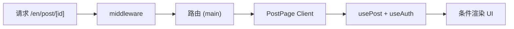

# 真实登录用户访问帖子详情页系统推演报告

**生成日期**: 2026-01-25  
**推演场景**: 已登录用户（Supabase session 有效、profile 非 banned/suspended）访问 `/[locale]/post/[id]`，页面渲染完成后可用的操作与 UI 状态

---

## 推演目标

- 页面访问链路（Middleware → 路由 → Client 页面 → 数据与鉴权）
- 已登录用户可见 / 可操作的功能（关注、私聊、举报、点赞、评论、转发、收藏、打赏、分享）
- 与未登录用户的差异（操作按钮可见性、可点性）
- 边界情况与潜在问题

---

## Step 1：Middleware

### 1.1 代码路径

- [middleware.ts](middleware.ts) → 调用 [src/lib/supabase/middleware.ts](src/lib/supabase/middleware.ts) 的 `updateSession`

### 1.2 执行流程

```ts
// middleware.ts
const response = await updateSession(request)
return intlMiddleware(request)
```

```ts
// src/lib/supabase/middleware.ts
const { data: { user } } = await supabase.auth.getUser()

if (user) {
  const { data: profile } = await supabase
    .from('profiles')
    .select('status, subscription_type, role, tip_enabled')
    .eq('id', user.id)
    .single()

  if (profile?.status === 'banned' || profile?.status === 'suspended') {
    return NextResponse.redirect(... '/banned')
  }
  // tip 订阅一致性检查（仅 log，不拦截）
}
return response
```

### 1.3 推演结果

- **Session 刷新**: `getUser()` 会刷新过期 token，已登录用户 session 有效。
- **Profile 检查**: 查询 `status`、`subscription_type`、`role`、`tip_enabled`；若 `banned` 或 `suspended` 则重定向 `/banned`。
- **帖子详情页**: 无单独拦截逻辑；已登录且未封禁用户访问 `/en/post/[id]` 时，middleware 不拦截、不重定向，由 `intlMiddleware` 继续处理 locale。

**结论**: 已登录且未封禁用户可正常进入帖子详情页，middleware 仅做 session 更新与封禁校验。

---

## Step 2：路由与布局

### 2.1 路由

- **路径**: `/[locale]/(main)/post/[id]`
- **页面**: [src/app/[locale]/(main)/post/[id]/page.tsx](src/app/[locale]/(main)/post/[id]/page.tsx)
- **布局**: `(main)` 含 Sidebar、TopBar；帖子详情页无单独 layout。

### 2.2 推演结果

- 与未登录用户相同路由，无登录门槛。
- 路由解析、layout 渲染正常；locale 由 next-intl 解析。

---

## Step 3：页面与数据

### 3.1 页面类型

- **类型**: 纯 **Client Component**（`'use client'`），无 Server Component 预取。

### 3.2 数据拉取

- **Hook**: `usePost(postId)`（[src/lib/hooks/usePosts.ts](src/lib/hooks/usePosts.ts)）
- **查询**: Supabase `posts` 单条，联表 `profiles`（作者）、`post_topics` / `topics`；RLS 生效，仅返回 `status = 'approved'` 且作者 `profiles.status = 'active'` 的帖子。
- **鉴权**: `useAuth()` → `user`，用于条件渲染与按钮禁用逻辑。

### 3.3 加载与错误

- **加载中**: `isLoading` → `<LoadingState />`
- **失败或不存在**: `error || !post` → `<EmptyState title={t('postNotFoundOrLoadFailed')} />`

### 3.4 推演结果

- 已登录与未登录使用同一 `usePost` 接口；RLS 不区分访问者，帖子可见性一致。
- 已登录用户 `user` 有值，后续 UI 按登录状态展示关注、转发、打赏、评论表单等。

---

## Step 4：登录用户可见 / 可操作 UI

### 4.1 创作者区（约 176–237 行）

| 条件 | 展示内容 |
|------|----------|
| `user && user.id !== post.user_id` | **FollowButton**、**ChatButton**（私聊作者）、**举报**按钮 |
| 本人帖子（`user.id === post.user_id`） | 不展示关注、私聊、举报 |

### 4.2 操作按钮（约 258–286 行）

| 按钮 | 未登录 | 已登录 | 说明 |
|------|--------|--------|------|
| 点赞 | 可见、禁用 | 可见、可点 | `LikeButton`，`disabled={!user}` |
| 评论 | 仅数量 | 仅数量 | 具体表单在 `CommentSection` |
| 转发 | 不渲染 | 可见、可点 | `{user && (...)}`，`handleRepost` 打开 `RepostDialog` |
| 收藏 | 可见、禁用 | 可见、可点 | `FavoriteButton`，`disabled={!user}` |
| 分享 | 可见、可点 | 可见、可点 | 无 `user` 判断，始终可点 |

### 4.3 打赏（约 289–296 行）

- **TipButton**: `if (!user) return null`，已登录才渲染。
- **内部逻辑**（[TipButton](src/components/social/TipButton.tsx)）:
  - `useProfile(user?.id)` → `tip_enabled`；未开启时展示「开通打赏」链接 → `/subscription/tip`。
  - `user.id === postAuthorId` → 文案「不能打赏自己」，不发起打赏。

### 4.4 评论区（CommentSection）

- **已登录**: 展示评论输入框、发送；可回复、举报、点赞评论。
- **未登录**: 展示「请登录后发表评论」链接（含 redirect）。

### 4.5 未登录 vs 已登录 对比小结

| 功能 | 未登录 | 已登录 |
|------|--------|--------|
| 点赞 | 可见、禁用 | 可见、可点 |
| 评论 | 无输入框，仅登录引导 | 有输入框，可发评论 / 回复 |
| 收藏 | 可见、禁用 | 可见、可点 |
| 打赏 | 不渲染 | 渲染（依 `tip_enabled` / 是否本人） |
| 转发 | 不渲染 | 可见、可点 |
| 分享 | 可见、可点 | 可见、可点 |
| 关注 / 私聊 / 举报 | 不展示（仅非本人帖子时展示） | 非本人帖子时展示并可操作 |

---

## Step 5：边界情况与潜在问题

| 情况 | 当前处理 |
|------|----------|
| 本人帖子 | 不展示关注、私聊、举报；打赏为「不能打赏自己」或入口引导开通 |
| 帖子不存在 / 未审核 / 作者非 active | RLS 过滤，`usePost` 无数据 → `EmptyState` |
| 已登录但 profile 缺失或异常 | `useAuth` 依赖 session；Follow、Tip 等依赖 `useProfile`，profile 异常时可能禁用或 fallback |
| 分享 | 已登录会写入 `shares`；未登录不写 |
| 举报 | 需登录，点击打开 `ReportDialog`；未登录提示先登录 |

---

## Step 6：推演结论

### 6.1 链路小结



- **Middleware** → 更新 session、校验 banned/suspended → 不拦截则继续。
- **路由** → `(main)` layout → `post/[id]/page.tsx`。
- **页面** → Client 组件，`usePost(postId)`、`useAuth()` → 按 `user` 条件渲染创作者区、操作按钮、打赏、评论区。

### 6.2 与未登录差异

- 关注、私聊、举报、转发、打赏、评论表单等仅登录可用。
- 点赞、收藏由禁用变为可点；分享始终可用。

### 6.3 可选改进（参考《已登录用户访问首页》）

- Middleware 仅做封禁与 session 更新，不做角色/订阅维度的路由保护；若后续需要统一拦截（如按角色重定向），可在 middleware 扩展。
- 帖子详情页为纯 Client Component，无服务端预取；若考虑 SEO 或首屏性能，可评估引入 Server Component 预取帖子数据。

---

## 总结

1. **访问与权限**: 已登录且未封禁用户可访问帖子详情页；与未登录共用 `usePost` 与 RLS，帖子可见性一致。
2. **操作**: 已登录可点赞、收藏、转发、分享、打赏（依 `tip_enabled` 与是否本人）、评论与回复、关注作者、私聊、举报；未登录仅可看、可分享，其余需登录。
3. **边界**: 本人帖子不展示关注/私聊/举报；打赏避免自己打自己；帖子不存在或不可见时 `EmptyState`。
